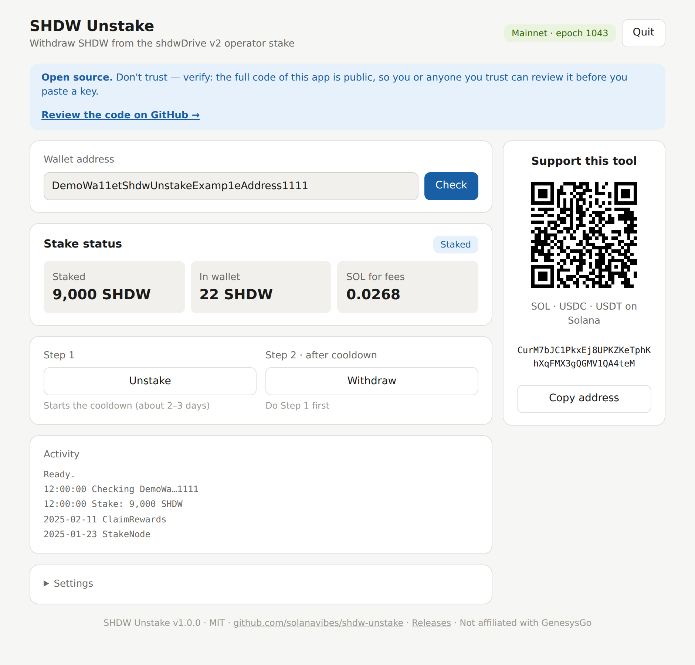
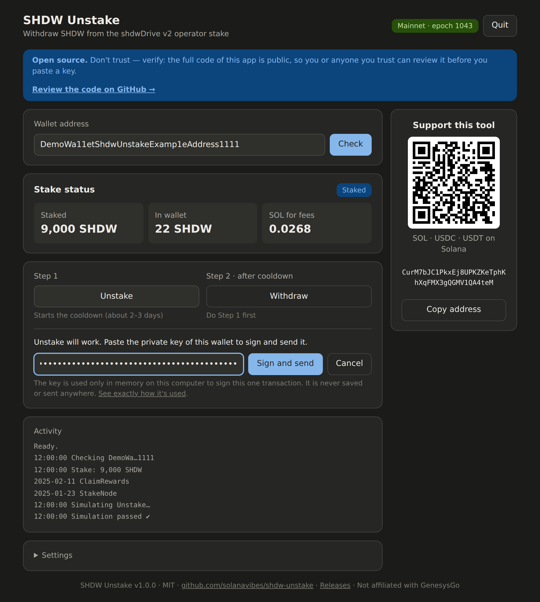

# SHDW Unstake

A small open-source app to **unstake and withdraw your SHDW** from the shdwDrive v2 operator (node) staking program on Solana — useful now that the official shdwDrive app no longer works for many operators.

It runs locally on your computer, shows your stake in a simple window, and signs transactions with your own key. Nothing is sent anywhere except to the Solana network.

Works on **Windows** and **macOS** (Linux too, from source).

<p align="center">
  <picture>
    <source media="(prefers-color-scheme: dark)" srcset="docs/screenshot-dark.png">
    
  </picture>
</p>

---

## Download

Get the latest version from **[Releases](https://github.com/solanavibes/shdw-unstake/releases/latest)**:

| Your computer | File |
|---|---|
| Windows | `shdw-unstake-windows-x64.exe` |
| Mac with Apple Silicon (M1–M4) | `shdw-unstake-macos-arm64.zip` |
| Mac with Intel | `shdw-unstake-macos-x64.zip` |

No installation needed — these are single files with everything inside. They are built automatically by GitHub from the code in this repository ([see the build workflow](.github/workflows/build.yml)).

## What you need

- Your **wallet address** (public).
- The **private key** of that wallet — only at the moment you sign. In Phantom: *Settings → Manage accounts → your account → Show private key*. This is one long string, **not** the 12/24-word seed phrase.
- A little **SOL** on the wallet for fees (0.005 SOL is plenty).

## How to use

1. **Start the app.**
   - **Windows:** double-click `shdw-unstake-windows-x64.exe`. If you see *"Windows protected your PC"*, click **More info → Run anyway** (the app is not code-signed, which costs money).
   - **macOS:** unzip the file and double-click `shdw-unstake`. If macOS blocks it, open **System Settings → Privacy & Security**, scroll down and click **Open Anyway** (the app is not notarized by Apple).
2. **Check:** the app opens in your browser. Paste your wallet address and press **Check**.
3. **Step 1 — Unstake:** press **Unstake**. The app simulates the transaction first; if it passes, paste your private key and press **Sign and send**.

   

4. **Step 2 — Withdraw:** after the cooldown (one Solana epoch, about 2–3 days), start the app again and press **Withdraw**. Your SHDW returns to your wallet.

Keep the black console window open while you use the app; close it to stop.

### Verify your download (optional)

Each release includes `SHA256SUMS.txt`. Compare it with the checksum of your file:

- Windows (Command Prompt): `certutil -hashfile shdw-unstake-windows-x64.exe SHA256`
- macOS (Terminal): `shasum -a 256 shdw-unstake-macos-arm64.zip`

### Run from source instead

If you prefer to run the code directly: install [Node.js](https://nodejs.org/) 18+ (LTS), click **Code → Download ZIP**, unzip, then:

- **Windows:** double-click `start.bat`
- **macOS:** open Terminal, type `bash ` (with a space), drag `start.command` into the window, press Enter

The first run installs components (1–2 minutes).

## Is it safe?

- The app listens only on `127.0.0.1` (your own computer) and every request needs a random session token, so other websites cannot talk to it.
- Your private key is used **in memory only**, to sign one transaction. It is never saved to disk, never logged, and never sent anywhere — only the signed transaction goes to Solana.
- Every action is **simulated first**. If the simulation fails, nothing is sent and no key is requested.
- The app refuses to sign if the key belongs to a different wallet than the one you checked.
- **Don't trust — verify.** The code is short and fully open: all blockchain logic is in [`src/stake.mjs`](src/stake.mjs) and the local server in [`src/server.mjs`](src/server.mjs). Read them or ask someone you trust to review them.
- Release files are built by GitHub Actions directly from this code, with published checksums.

**Never** give your private key to anyone, and never paste it into websites or "recovery services". This tool never asks you to share it — it only asks you to paste it into the app on your own computer.

## Tips and troubleshooting

| Message | What to do |
|---|---|
| *No stake* | This wallet has no operator stake in shdwDrive v2. Nothing to withdraw. |
| *Rate-limited / RPC rejected / does not allow stake search* | Open **Settings** at the bottom of the app and paste a free RPC URL from [helius.dev](https://www.helius.dev/) (Dashboard → RPC URL). |
| *Withdraw is not possible right now* | The cooldown is still running. Try again tomorrow. |
| *Unstake is not possible right now* | You have probably unstaked already — use **Withdraw**. |
| *Not enough SOL for fees* | Send about 0.005 SOL to the wallet. |
| *This looks like a seed phrase* | Export the private key instead (see *What you need*). |
| macOS: *"cannot be opened"* / *"unidentified developer"* | System Settings → Privacy & Security → **Open Anyway**. Running from source: use `bash start.command`. |
| Windows: *"Windows protected your PC"* | Click **More info → Run anyway**. |
| Browser did not open | Copy the link shown in the launcher window into your browser. |

## Scope

- Works only with the **shdwDrive v2 operator staking** program `BsbBGrUe9SiGYPUVDvmLb9ppfkJc4esMKdacpepc3T23`.
- It does **not** handle the old 2024 testnet staking pool or any other staking program.
- Unclaimed node rewards cannot be claimed with this tool: those require a co-signature from the shdwDrive backend.
- The stake program is controlled by its authors and can change at any time. The app always simulates before sending, so a changed program results in a clear error, not a lost transaction.

## Support

If this tool helped you get your SHDW back, a small tip is very welcome and keeps projects like this alive.

**Solana address (SOL, USDC, USDT):**

```
CurM7bJC1PkxEj8UPKZKeTphKhXqFMX3gQGMV1QA4teM
```

The same address and a QR code are shown in the app. Thank you! 🙏

## License

[MIT](LICENSE) © 2026 solanavibes

Not affiliated with GenesysGo or shdwDrive. Use at your own risk. This software is provided "as is", without warranty of any kind.
